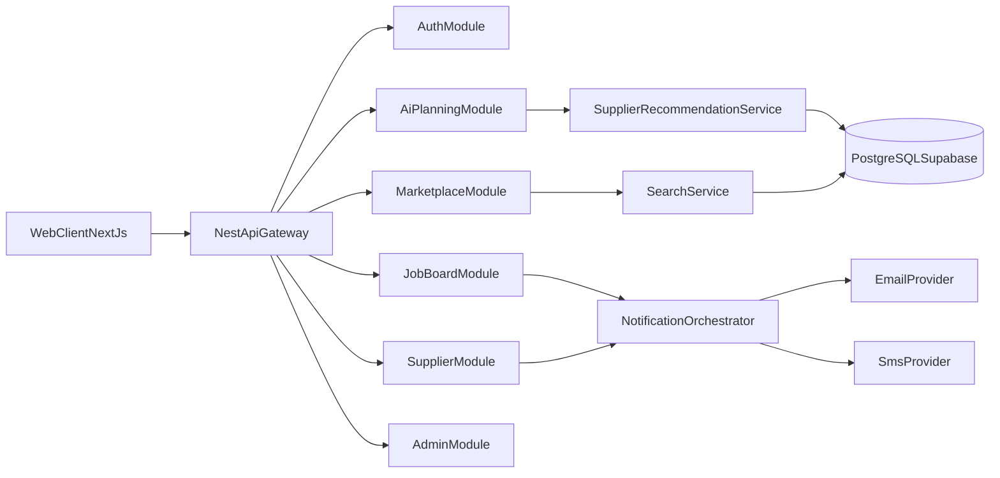
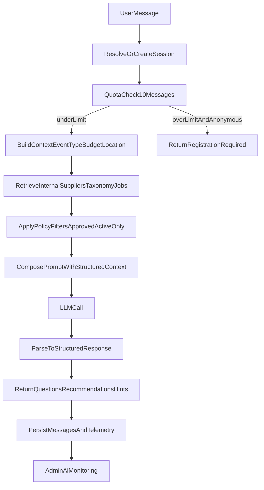

# Backend Plan — Event Supplier Marketplace

## Target Architecture
- Backend: NestJS modular monolith (API-first), with room to split services later.
- Database: PostgreSQL (preferably via Supabase) with Prisma ORM as the only database access layer.
- Search: PostgreSQL full-text + trigram in early phases, optional dedicated search engine later.
- AI: LLM adapter layer with internal supplier-recommendation retrieval (no open-web recommendations).
- Notifications: event-driven notification pipeline (Email/SMS now, WhatsApp-ready interface).
- Auth: role-aware auth with conditional registration gates (anonymous browsing, AI quota gate, mandatory account for job posting).
- Infra pattern: API layer -> domain services -> Prisma repositories -> PostgreSQL; async domain events for automations.
- Containerization: Docker-first local development and environment parity across dev/staging/prod.

## Non-Negotiable Business Rules (From PRD)
- Browsing suppliers is open to anonymous visitors.
- Account creation is required only when:
  - AI usage exceeds 10 messages.
  - User publishes a job offer.
- Supplier account is always required for supplier actions.
- Platform never processes event payments/commissions; it only connects users and suppliers.
- AI recommendations must come from internal platform data (suppliers/categories/jobs), not generic web suggestions.

## AI Workflow (Detailed End-to-End)

### AI Request Lifecycle
- Input contract:
  - session id (or create new)
  - user identity state (`anonymous` or `registered`)
  - optional event context (`eventType`, `date`, `budget`, `location`, `guestCount`)
  - user message
- Processing stages:
  - enforce quota gate before LLM call
  - enrich conversation state with known context from prior turns
  - retrieve relevant suppliers by category/tags/location/rating/verification
  - retrieve relevant categories/subcategories from taxonomy mapping
  - retrieve open job templates/hints when user intent is better served by job board
  - build constrained prompt with only internal context payload
  - parse output into strict JSON schema (question list, supplier recommendations, category suggestions, budget tips, redirect hints)
- Output contract:
  - assistant message
  - follow-up questions
  - supplier recommendation cards (`supplierId`, reason, confidence)
  - suggested categories/subcategories
  - CTA hints (`openMarketplace`, `publishJob`)
  - gating status (`continue`, `registration_required`)

### AI Edge Cases and Guardrails
- Quota edge cases:
  - anonymous user on exactly 10th message: allow response; next message requires registration.
  - duplicate request retries (network retry): idempotency key prevents double-counting usage.
  - multi-tab anonymous sessions: usage keyed by durable anonymous token/device fingerprint + session.
- Retrieval edge cases:
  - no matching suppliers: return fallback with related categories and suggestion to publish job.
  - only unapproved suppliers match: exclude and return nearest approved alternatives.
  - stale supplier data: recommendations filtered by `isApproved` and `isActive`.
- Prompt/LLM edge cases:
  - malformed model output: parser fallback to safe plain response and log parse error.
  - timeout/provider outage: graceful error + retry strategy + user-facing temporary fallback.
  - hallucinated suppliers: validate every recommended `supplierId` exists and is eligible before responding.
- Safety/abuse:
  - rate-limit AI endpoint by IP/session/user id.
  - detect prompt injection attempts and strip instructions that request non-platform data leakage.
  - store redacted logs for admin review; avoid storing sensitive free text in analytics aggregates.

## Phase 0 — Foundation & Domain Modeling
- Set up NestJS project structure, environment strategy, Prisma migration workflow, and observability baseline.
- Add Docker baseline:
  - `Dockerfile` for backend runtime/build stages.
  - `docker-compose.yml` for local `api + postgres` stack.
  - `.dockerignore` for lean images.
- Define canonical data model for: users, suppliers, supplier drafts, supplier approvals, categories, subcategories, filter schemas, supplier attributes, jobs, job applications, AI sessions/messages, favorites, referrals, notifications.
- Implement RBAC roles: `USER`, `SUPPLIER`, `ADMIN` plus anonymous visitor capabilities.
- Create audit fields and soft-delete strategy for admin visibility requirements (including incomplete/unpaid users).
- Deliverables:
  - ERD + `prisma/schema.prisma` data model.
  - Prisma migrations + seed scripts for categories/subcategories/filter taxonomy.
  - Shared Prisma client module in NestJS (for DI, transactions, and repository/service usage).
  - Base API health/version endpoints and centralized error format.

### Phase 0 Detail
- Prisma conventions:
  - snake_case DB columns, camelCase app fields.
  - required `createdAt`, `updatedAt`, nullable `deletedAt`.
  - enums for status fields (supplier approval status, job status, notification status, referral status).
  - composite indexes for common queries (search, job matching, AI telemetry).
- Core entities:
  - `User`, `UserProfile`, `AnonymousSession`
  - `Supplier`, `SupplierDraft`, `SupplierApprovalHistory`, `SupplierMedia`
  - `Category`, `Subcategory`, `EventType`, `FilterDefinition`, `EventCategorySubcategoryMap`
  - `JobPost`, `JobApplication`
  - `AiConversation`, `AiMessage`, `AiUsageCounter`, `AiRecommendationLog`
  - `FavoriteSupplier`, `Referral`, `ReferralReward`
  - `Notification`, `NotificationTemplate`, `AutomationRule`, `AutomationRun`
- Acceptance criteria:
  - All migrations run from clean DB.
  - Seed creates minimal taxonomy for search/filter/AI tests.
  - Prisma client singleton and transaction helper available to all modules.
  - `docker compose up` boots API + PostgreSQL successfully.
  - API health endpoint responds from containerized runtime.

## Phase 1 — Marketplace Core (User + Supplier Read Side)
- Implement supplier profile CRUD (supplier-authenticated write, public read).
- Implement supplier approval workflow: draft -> pending -> approved -> rejected.
- Implement marketplace listing with live-search-ready endpoints (typeahead, facets, pagination).
- Implement dynamic 3-layer filtering logic:
  - eventType -> category -> subcategory mapping,
  - category-specific filters,
  - global filters.
- Implement supplier favorites/save/share metadata endpoints for users.
- Deliverables:
  - Public supplier search API and profile API.
  - Admin-managed taxonomy endpoints (categories/subcategories/filter options).
  - Initial search performance SLA and indexes.

### Phase 1 Detail
- Public APIs:
  - `GET /suppliers` with query params for text + layered filters.
  - `GET /suppliers/:slugOrId`.
  - `GET /search/suggestions` for live suggestions (name/category/tag).
- Supplier private APIs:
  - profile create/update, gallery management, working days, certifications, accessibility flags, kosher/language options.
- Filtering implementation:
  - layer 1: subcategories constrained by selected event type + category map.
  - layer 2: category-specific filters derived from `FilterDefinition`.
  - layer 3: global filters always available.
- Edge cases:
  - conflicting filters (no results): return empty list + suggested filter relaxations.
  - invalid taxonomy id in query: ignore with validation warning, do not 500.
  - high cardinality areas/tags: protect with capped facets and deterministic ordering.

## Phase 2 — Auth Gates & Identity Rules
- Implement conditional registration rules:
  - anonymous browsing allowed,
  - AI usage capped at 10 messages before account requirement,
  - job posting requires account,
  - supplier actions always require supplier account.
- Add email/OTP or password auth flows; support social login later if needed.
- Persist AI usage counters for anonymous and authenticated sessions with anti-abuse controls.
- Deliverables:
  - Auth endpoints and guard middleware/interceptors.
  - Business-rule enforcement tests for the three registration triggers.

### Phase 2 Detail
- Auth model:
  - JWT for registered users/suppliers/admin.
  - anonymous token issued for non-auth users to track AI usage and favorites pre-login.
  - optional account linking path (anonymous -> registered) to merge history.
- Required guard behaviors:
  - `AiQuotaGuard`: checks message count and blocks over-limit anonymous users.
  - `JobPublishGuard`: blocks non-authenticated publication attempts.
  - `SupplierOnlyGuard`: protects supplier dashboard and application endpoints.
- Edge cases:
  - email already exists across roles: enforce single identity with role assignments.
  - merged anonymous history double-insert risk: use unique constraints/idempotent merge.
  - token replay attempts: rotate refresh tokens and revoke on suspicious activity.

## Phase 3 — AI Planning Agent (Platform-Scoped Recommendations)
- Build AI conversation module with session/message persistence.
- Create recommendation retrieval layer that only queries platform suppliers/taxonomy/jobs.
- Support response payload with:
  - clarifying questions,
  - recommended suppliers,
  - relevant categories,
  - budget heuristics,
  - redirect hints to job board.
- Add AI monitoring logs for admin visibility (usage/failures/recommendation quality signals).
- Deliverables:
  - AI chat API with quota gate integration.
  - Prompt orchestration and retrieval guardrails to prevent generic external-only answers.

### Phase 3 Detail
- AI APIs:
  - `POST /ai/conversations`
  - `POST /ai/conversations/:id/messages`
  - `GET /ai/conversations/:id`
- Recommendation ranking:
  - score by category fit, event-type fit, location proximity/service area, rating, verification status, recency/activity.
  - tie-breakers deterministic for repeatable output.
- Admin observability:
  - store token usage, latency, retrieval hit-rate, recommendation acceptance click-through events.
  - provide failure reason tags (timeout, parse_error, no_candidates, quota_blocked).
- Edge cases:
  - conversation context overflow: summarize previous turns and keep structured memory.
  - user changes event type mid-conversation: reset/branch recommendation context.
  - multilingual input (Hebrew/English mix): normalized taxonomy matching before retrieval.

## Phase 4 — Job Board + Supplier Applications
- Implement job post creation/edit/publish lifecycle (user account required).
- Model job applications from suppliers with candidate history tracking.
- Trigger notifications when suppliers apply and when matching jobs are posted.
- Provide supplier dashboard endpoints for browsing relevant jobs and applying.
- Deliverables:
  - Job board APIs (public browsing + authenticated posting/applying).
  - Application timeline/history records for admin and user views.

### Phase 4 Detail
- Job post states:
  - `draft`, `published`, `closed`, `archived`.
- APIs:
  - user: create/edit/publish/list own jobs.
  - supplier: list matching jobs/apply/withdraw.
  - admin: view all jobs/applications/report abuse.
- Matching logic:
  - event type + category/subcategory + location + budget compatibility + date availability window.
- Edge cases:
  - supplier applies twice: enforce uniqueness per supplier-job with clear error.
  - user edits job after applications: snapshot changes and notify applicants when material fields change.
  - job post with past date: reject publish with validation code.

## Phase 5 — Supplier Onboarding Completion + Draft Recovery
- Implement autosave supplier registration draft capability across onboarding steps.
- Resume onboarding from last step; preserve media and partial metadata.
- Expose admin views for incomplete supplier registrations/unpaid states.
- Add reminder automation triggers for incomplete onboarding.
- Deliverables:
  - Supplier draft/resume endpoints.
  - Admin tracking and reminder trigger endpoints.

### Phase 5 Detail
- Draft strategy:
  - incremental autosave per step with version number.
  - optimistic concurrency to avoid overwriting in multi-tab edits.
  - TTL policy for stale drafts plus admin visibility.
- Admin visibility:
  - list incomplete suppliers with completion percentage and last activity timestamp.
- Edge cases:
  - media upload succeeded but metadata save failed: recover orphan media via reconciliation job.
  - supplier abandons before payment/approval: preserve record for reminders and admin pipeline.
  - resumed flow after taxonomy changes: migration helper maps old values to current options.

## Phase 6 — Notifications & Automation Engine
- Establish event bus pattern (`domain events` + async workers/queues).
- Implement template-based notifications for Email and SMS channels.
- Add automation rules from PRD (user/supplier/admin reminders and alerts).
- Design notification channel abstraction for future WhatsApp support.
- Deliverables:
  - Notification service with retry/dlq logic.
  - Automation rule registry and schedulers.

### Phase 6 Detail
- Domain events examples:
  - `job.application.submitted`
  - `supplier.profile.incomplete.reminder_due`
  - `ai.quota.near_limit`
  - `supplier.approval.status_changed`
- Delivery pipeline:
  - event -> rule evaluation -> template render -> channel dispatch -> status tracking.
  - retries with exponential backoff and dead-letter queue.
- Edge cases:
  - provider outage (email/sms): failover queue and delayed retry.
  - duplicate event delivery: dedupe by event id + recipient + template key.
  - user unsubscribed/invalid phone: mark channel as invalid and fallback to alternate channel if policy allows.

## Phase 7 — Referrals, Monetization Hooks, and Admin Depth
- Implement supplier referral link generation and attribution tracking.
- Add referral completion verification and reward-eligibility calculation framework.
- Extend admin tooling for referral management, featured suppliers, abuse reports, AI usage oversight.
- Add billing/subscription hooks (even if payment integration is phased later).
- Deliverables:
  - Referral APIs + supplier referral dashboard data.
  - Admin endpoints for rewards governance and referral audits.

### Phase 7 Detail
- Referral flow:
  - generate unique referral code/link per supplier.
  - attribute new supplier registration by code.
  - confirm completion when referred supplier reaches required milestones (to be configurable).
  - compute reward eligibility and emit reward-ready event.
- Edge cases:
  - self-referral attempt: block and flag.
  - multiple referral codes used: first-touch or last-touch policy (choose one and enforce deterministically).
  - fraudulent referral rings: admin risk flags and manual review queue.

## Phase 8 — Hardening, Performance, and Go-Live Readiness
- Security hardening: rate limits, abuse detection, PII handling, audit trails.
- Performance tuning: query optimization, search latency targets, cache strategy.
- Reliability: idempotent notification jobs, backoff policies, failure dashboards.
- QA/UAT support: seed scenarios covering all PRD flows.
- Deliverables:
  - Production checklist (SLOs, backup, migration rollback, incident playbook).
  - Load test and API contract validation results.

### Phase 8 Detail
- Reliability and ops:
  - health checks for DB, queue, notification providers, AI provider.
  - structured logs with correlation id per request.
  - alerting thresholds for AI error rate, queue backlog, search latency.
- Performance targets:
  - supplier search p95 under agreed threshold.
  - AI response p95 with fallback policy.
  - job application write path idempotent and resilient.
- Security edge cases:
  - abuse from scraping supplier contacts: per-IP throttling + anomaly detection.
  - sensitive admin endpoints: strict RBAC + audit log on reads and writes.
  - file uploads: MIME/type validation + malware scanning hook.
- Docker and release hardening:
  - multi-stage image build (builder + runtime).
  - non-root runtime user.
  - pinned Node base image tag.
  - image vulnerability scan in CI.
  - startup command applies Prisma deploy migrations safely for target environment.

## Suggested Backend Module Layout (Proposed)
- [`backend/src/modules/auth`](backend/src/modules/auth)
- [`backend/src/modules/users`](backend/src/modules/users)
- [`backend/src/modules/suppliers`](backend/src/modules/suppliers)
- [`backend/src/modules/marketplace-search`](backend/src/modules/marketplace-search)
- [`backend/src/modules/ai-planning`](backend/src/modules/ai-planning)
- [`backend/src/modules/job-board`](backend/src/modules/job-board)
- [`backend/src/modules/notifications`](backend/src/modules/notifications)
- [`backend/src/modules/referrals`](backend/src/modules/referrals)
- [`backend/src/modules/admin`](backend/src/modules/admin)
- [`backend/src/modules/taxonomy`](backend/src/modules/taxonomy)

## Testing and Quality Plan
- Unit tests:
  - guards (AI quota, job publish requirement, supplier-only actions)
  - filter engine (3-layer logic and mapping behavior)
  - referral eligibility calculator
- Integration tests:
  - Prisma repositories against test DB
  - AI pipeline with mocked provider and strict output schema validation
  - notification retry and dead-letter handling
- End-to-end tests:
  - anonymous browse -> AI 10 messages -> registration gate
  - registered user publishes job -> supplier applies -> user notified
  - supplier starts onboarding -> abandons -> resumes -> admin sees incomplete
- Contract tests:
  - API response schemas for frontend compatibility
  - AI structured output schema compatibility

## API Design Principles
- Versioned REST endpoints (`/v1`).
- Consistent error object (`code`, `message`, `details`, `traceId`).
- Idempotency key support for message send/apply actions.
- Cursor-based pagination for large datasets (search, jobs, admin lists).
- Standardized filter DSL for marketplace endpoints.

## Docker Plan (Detailed)

### Local Development
- Services in `docker-compose.yml`:
  - `api` (NestJS backend)
  - `postgres` (local dev DB)
- Optional later services:
  - `redis` (if queue/cache is introduced)
  - `worker` (for notifications/automation jobs)
- Local flow:
  - `docker compose up --build`
  - run Prisma migrate/seed either at container start or one-off command container.

### Dockerfile Strategy
- Multi-stage build:
  - `deps` stage: install node modules.
  - `build` stage: compile TS and generate Prisma client.
  - `runtime` stage: copy dist + prisma assets + production deps only.
- Runtime requirements:
  - expose app port.
  - include `prisma` directory for migration deploy.
  - healthcheck command for orchestrator readiness/liveness.

### Environment Strategy
- `.env` for local development only.
- `.env.example` maintained as canonical template.
- per-environment secrets provided by deployment platform (not baked into image).
- explicit variables:
  - `DATABASE_URL`
  - `PORT`
  - `NODE_ENV`
  - AI/Email/SMS provider credentials

### CI/CD Container Pipeline
- Build image on every PR and main branch.
- Run checks in containerized context:
  - `npm run build`
  - `prisma validate`
  - tests (as added in later phases)
- Security scanning gate:
  - fail on critical vulnerabilities unless explicitly waived.
- Tagging strategy:
  - immutable SHA tag + semantic tag for releases.

### Production Deployment Notes
- Run one app replica minimum; scale horizontally behind load balancer.
- Run migrations in controlled step before traffic shift.
- Ensure graceful shutdown handling for in-flight requests.
- Separate worker deployment when async automations are enabled.

### Docker Edge Cases
- DB not ready when app starts:
  - use retry/wait-for-db strategy before app boot.
- Prisma client mismatch after schema change:
  - force `prisma generate` in image build stage.
- platform architecture mismatch (arm64 vs amd64):
  - set explicit image platform targets in CI builds.
- volume permission issues on local postgres:
  - document cleanup/reset commands and named volume ownership.
- migration failure at startup:
  - app should fail fast and surface clear logs; no partial boot.

## Suggested Execution Order Inside MVP (Phases 0-4)
- Sprint 1: Phase 0 foundation + Docker baseline + taxonomy seed + auth shell.
- Sprint 2: supplier profile + approval + marketplace search/filter APIs.
- Sprint 3: AI conversation + quota guard + recommendation retrieval.
- Sprint 4: job board posting/apply + notifications for applications.
- Sprint 5: MVP stabilization, instrumentation, and UAT bug fixing.

## Prisma Data Model Blueprint (Technical Spec)
- This is the target model inventory to define in [`prisma/schema.prisma`](prisma/schema.prisma) in iterative migrations.

### Identity and Access
- `User`
  - fields: `id`, `email` (unique), `phone` (nullable, unique), `passwordHash` (nullable), `status`, `createdAt`, `updatedAt`, `deletedAt`
  - relations: `roles[]`, `profile`, `aiConversations[]`, `jobPosts[]`, `favorites[]`, `notifications[]`
- `UserRole`
  - fields: `id`, `userId`, `role` (`USER|SUPPLIER|ADMIN`), `createdAt`
  - constraints: unique (`userId`, `role`)
- `UserProfile`
  - fields: `id`, `userId`, `fullName`, `locale`, `city`, `createdAt`, `updatedAt`
- `AnonymousSession`
  - fields: `id`, `token` (unique), `fingerprintHash`, `ipHash`, `lastSeenAt`, `createdAt`
  - purpose: AI quota + optional pre-login favorites

### Supplier Domain
- `Supplier`
  - fields: `id`, `ownerUserId`, `businessName`, `slug` (unique), `description`, `approvalStatus`, `isActive`, `isVerified`, `ratingAvg`, `ratingCount`, `createdAt`, `updatedAt`, `deletedAt`
  - relations: `owner`, `categories[]`, `serviceAreas[]`, `media[]`, `socialLinks[]`, `attributes`, `draft`, `applications[]`, `referralsMade[]`, `notifications[]`
- `SupplierDraft`
  - fields: `id`, `supplierId` (unique), `stepKey`, `completionPercent`, `payloadJson`, `version`, `lastAutosaveAt`, `createdAt`, `updatedAt`
- `SupplierApprovalHistory`
  - fields: `id`, `supplierId`, `fromStatus`, `toStatus`, `reason`, `actorAdminUserId`, `createdAt`
- `SupplierMedia`
  - fields: `id`, `supplierId`, `mediaType`, `url`, `sortOrder`, `metadataJson`, `createdAt`
- `SupplierSocialLink`
  - fields: `id`, `supplierId`, `platform`, `url`
- `SupplierAttribute`
  - fields: `id`, `supplierId`, `insurance`, `accessibility`, `kosherOptions`, `languagesJson`, `govSupplierFlagsJson`, `workingDaysJson`, `certificationsJson`
- `SupplierServiceArea`
  - fields: `id`, `supplierId`, `regionCode`, `cityCode`

### Taxonomy and Filters
- `EventType`
  - fields: `id`, `key` (unique), `name`, `isActive`
- `Category`
  - fields: `id`, `key` (unique), `name`, `isActive`, `sortOrder`
- `Subcategory`
  - fields: `id`, `categoryId`, `key`, `name`, `isActive`, `sortOrder`
  - constraints: unique (`categoryId`, `key`)
- `EventCategorySubcategoryMap`
  - fields: `id`, `eventTypeId`, `categoryId`, `subcategoryId`, `priority`, `isDefault`
  - constraints: unique (`eventTypeId`, `categoryId`, `subcategoryId`)
- `FilterDefinition`
  - fields: `id`, `scope` (`GLOBAL|CATEGORY`), `categoryId` (nullable), `key`, `label`, `type`, `optionsJson`, `isActive`, `sortOrder`
  - constraints: unique (`scope`, `categoryId`, `key`)
- `SupplierCategory`
  - fields: `id`, `supplierId`, `categoryId`, `subcategoryId` (nullable)

### Marketplace Interaction
- `FavoriteSupplier`
  - fields: `id`, `userId` (nullable), `anonymousSessionId` (nullable), `supplierId`, `createdAt`
  - constraints: unique (`userId`, `supplierId`) and unique (`anonymousSessionId`, `supplierId`)
- `SupplierViewEvent`
  - fields: `id`, `supplierId`, `userId` (nullable), `anonymousSessionId` (nullable), `source`, `createdAt`

### AI Domain
- `AiConversation`
  - fields: `id`, `userId` (nullable), `anonymousSessionId` (nullable), `status`, `contextJson`, `createdAt`, `updatedAt`
- `AiMessage`
  - fields: `id`, `conversationId`, `role` (`USER|ASSISTANT|SYSTEM`), `content`, `tokenCount`, `latencyMs`, `createdAt`
- `AiUsageCounter`
  - fields: `id`, `userId` (nullable), `anonymousSessionId` (nullable), `messageCount`, `periodStartAt`, `periodEndAt`, `updatedAt`
- `AiRecommendationLog`
  - fields: `id`, `conversationId`, `messageId`, `supplierId`, `score`, `reasonsJson`, `clickedAt` (nullable), `createdAt`

### Job Board
- `JobPost`
  - fields: `id`, `ownerUserId`, `title`, `eventTypeId`, `eventDate`, `locationText`, `budgetMin`, `budgetMax`, `guestCount`, `description`, `status`, `createdAt`, `updatedAt`, `publishedAt`
- `JobPostCategoryNeed`
  - fields: `id`, `jobPostId`, `categoryId`, `subcategoryId` (nullable)
- `JobApplication`
  - fields: `id`, `jobPostId`, `supplierId`, `message`, `status`, `submittedAt`, `updatedAt`
  - constraints: unique (`jobPostId`, `supplierId`)
- `JobApplicationHistory`
  - fields: `id`, `jobApplicationId`, `fromStatus`, `toStatus`, `reason`, `actorType`, `actorId`, `createdAt`

### Referral and Rewards
- `ReferralLink`
  - fields: `id`, `referrerSupplierId`, `code` (unique), `isActive`, `createdAt`
- `ReferralAttribution`
  - fields: `id`, `referralLinkId`, `referredSupplierId`, `attributedAt`, `status`
  - constraints: unique (`referredSupplierId`)
- `ReferralReward`
  - fields: `id`, `referrerSupplierId`, `referralAttributionId`, `rewardType`, `rewardValueJson`, `status`, `eligibleAt`, `grantedAt`

### Notifications and Automations
- `NotificationTemplate`
  - fields: `id`, `key` (unique), `channel`, `subjectTemplate`, `bodyTemplate`, `isActive`, `version`
- `Notification`
  - fields: `id`, `recipientUserId` (nullable), `recipientSupplierId` (nullable), `channel`, `templateKey`, `payloadJson`, `status`, `providerMessageId`, `errorCode`, `scheduledAt`, `sentAt`, `createdAt`
- `AutomationRule`
  - fields: `id`, `key` (unique), `triggerEvent`, `conditionJson`, `actionJson`, `isActive`, `createdAt`
- `AutomationRun`
  - fields: `id`, `ruleId`, `triggerEventId`, `status`, `attemptCount`, `lastError`, `createdAt`, `updatedAt`

## API Surface (Module-by-Module)

### Auth and Identity
- `POST /v1/auth/register`
- `POST /v1/auth/login`
- `POST /v1/auth/refresh`
- `POST /v1/auth/logout`
- `POST /v1/auth/anonymous-session`
- `POST /v1/auth/link-anonymous`
- `GET /v1/auth/me`

### Taxonomy and Filters
- `GET /v1/taxonomy/event-types`
- `GET /v1/taxonomy/categories`
- `GET /v1/taxonomy/categories/:id/subcategories`
- `GET /v1/taxonomy/filter-definitions`
- `GET /v1/taxonomy/mapping?eventTypeId=&categoryId=`
- `POST /v1/admin/taxonomy/*` (admin CRUD endpoints for taxonomy models)

### Suppliers and Marketplace
- `GET /v1/suppliers`
- `GET /v1/suppliers/:idOrSlug`
- `POST /v1/supplier/profile`
- `PATCH /v1/supplier/profile`
- `POST /v1/supplier/media`
- `DELETE /v1/supplier/media/:id`
- `GET /v1/search/suggestions?q=`
- `POST /v1/suppliers/:id/favorite`
- `DELETE /v1/suppliers/:id/favorite`
- `GET /v1/users/me/favorites`

### Supplier Approval and Admin Supplier Controls
- `GET /v1/admin/suppliers`
- `GET /v1/admin/suppliers/incomplete`
- `POST /v1/admin/suppliers/:id/approve`
- `POST /v1/admin/suppliers/:id/reject`
- `POST /v1/admin/suppliers/:id/feature`

### AI Planning
- `POST /v1/ai/conversations`
- `GET /v1/ai/conversations/:id`
- `POST /v1/ai/conversations/:id/messages`
- `GET /v1/admin/ai/usage`
- `GET /v1/admin/ai/failures`
- `GET /v1/admin/ai/conversations`

### Job Board
- `GET /v1/jobs`
- `POST /v1/jobs`
- `PATCH /v1/jobs/:id`
- `POST /v1/jobs/:id/publish`
- `POST /v1/jobs/:id/close`
- `GET /v1/users/me/jobs`
- `GET /v1/supplier/jobs/recommended`
- `POST /v1/jobs/:id/applications`
- `GET /v1/jobs/:id/applications`
- `PATCH /v1/job-applications/:id/status`

### Notifications and Automations
- `GET /v1/admin/notifications`
- `POST /v1/admin/notifications/retry/:id`
- `GET /v1/admin/automations/rules`
- `PATCH /v1/admin/automations/rules/:id`
- `GET /v1/admin/automations/runs`

### Referrals
- `GET /v1/supplier/referrals/link`
- `POST /v1/supplier/referrals/link/regenerate`
- `GET /v1/supplier/referrals/attributions`
- `GET /v1/supplier/referrals/rewards`
- `GET /v1/admin/referrals`
- `PATCH /v1/admin/referrals/rewards/:id`

## AI Workflow Specifications (Expanded)
- Conversation state machine:
  - `active` -> `gated_registration_required` -> `resumed_after_registration` -> `closed`
- Recommendation strategy:
  - step 1: infer intent (`need supplier`, `need idea`, `need budget`, `should publish job`)
  - step 2: map intent to taxonomy (event type/category/subcategory)
  - step 3: query suppliers with eligibility filters (`approved`, `active`, optional location and rating threshold)
  - step 4: rank and return top N with explanation tags
  - step 5: if low confidence or low inventory, suggest job board route
- Data contracts:
  - request metadata must include `clientRequestId` for idempotency
  - response includes `decisionTrace` for internal logs (not always exposed publicly)
- AI failure handling:
  - retrieval success + model failure -> fallback deterministic recommendation template
  - retrieval failure + model success -> return category guidance only, no fake supplier names
  - both fail -> graceful temporary-unavailable response + retry hint

## Critical Edge Cases Checklist
- Identity:
  - user starts as anonymous, favorites suppliers, then registers: favorites merge correctly.
  - duplicate email between supplier/user attempts role extension, not account duplication.
- Supplier lifecycle:
  - supplier rejected after previously approved: hidden from search immediately and cached indexes invalidated.
  - supplier marked inactive while referenced in old AI logs: historical logs remain valid, future recommendations exclude.
- Search/filter:
  - event type changed after filters selected: invalid dependent filters reset automatically.
  - taxonomy entry disabled by admin: active sessions gracefully ignore removed options.
- Job board:
  - job closed while supplier applying: enforce transactional check and fail with business code.
  - user deletes account with active jobs: policy-driven reassignment/archive before hard delete.
- Notifications:
  - sms/email sent twice due to worker retry: dedupe key prevents duplicate customer-facing sends.
  - provider callback missing: system reconciles status by polling or timeout transitions.
- AI:
  - malicious content in prompt: sanitize and store flagged conversation markers.
  - recommendation references outdated price/rating: include freshness timestamp in recommendation rationale.
- Referrals:
  - referred supplier never completes onboarding: remains pending, no reward generated.
  - referral reward policy changes mid-cycle: reward snapshot rule version stored at eligibility time.

## Prioritized Delivery Backlog (P0/P1/P2)

### P0 (Must-Have for MVP Launch)
- Prisma schema + migrations for identity, supplier, taxonomy, AI core, jobs, notifications.
- Dockerfile + docker-compose dev stack for API + Postgres.
- Auth with anonymous session support and conditional registration guards.
- Supplier profile CRUD + admin approval + searchable public listing.
- Dynamic 3-layer filtering engine with event-type mapping.
- AI conversation endpoint with internal-only retrieval and 10-message quota gate.
- Job posting + supplier application flow + user notification trigger.
- Admin basic dashboards for users/suppliers/jobs/AI usage.
- Core observability: request tracing, error logging, AI/notification failure metrics.

### P1 (Post-MVP, Revenue and Retention)
- Supplier draft autosave/resume with admin incomplete pipeline and reminders.
- Full automation engine with retry/DLQ and configurable rules.
- Referral link generation, attribution, eligibility, and supplier/admin referral dashboards.
- Enhanced anti-abuse protections (AI and scraping).
- Search relevance tuning and facet analytics.

### P2 (Scale and Optimization)
- Dedicated search service migration (if needed by scale).
- advanced personalization for AI recommendations.
- WhatsApp notification channel support.
- fraud heuristics for referral abuse rings.
- data warehouse sync and BI-grade reporting.

## Implementation Priorities (MVP to Revenue)
- MVP readiness: Phases 0-4.
- Conversion/revenue lift: Phases 5-7.
- Production scale/go-live confidence: Phase 8.