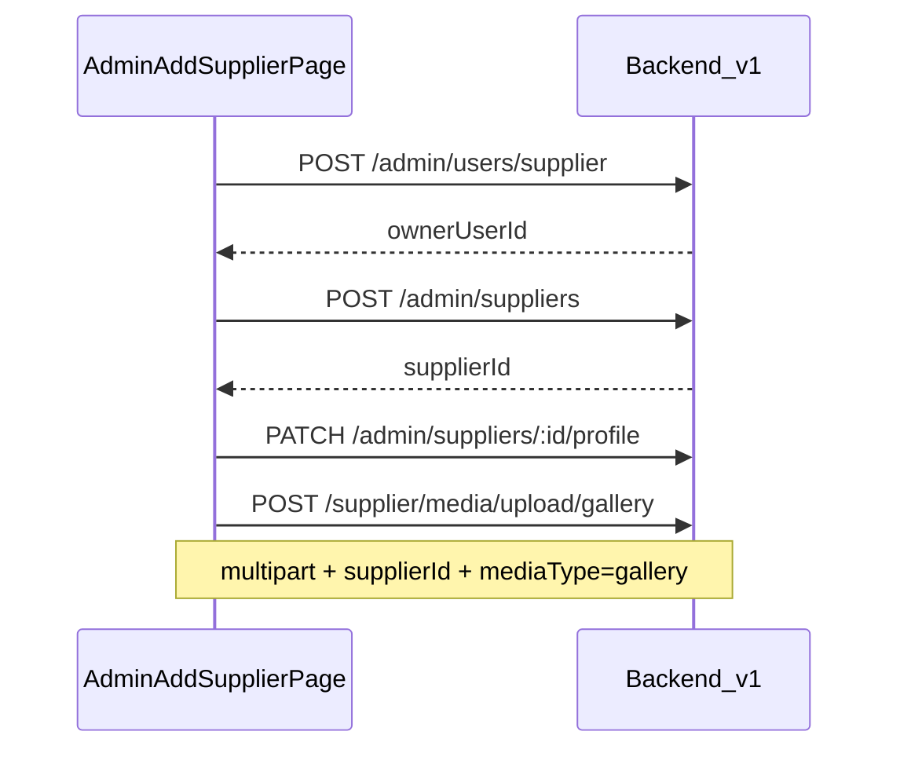

# Admin supplier onboarding (`/admin/suppliers/add`)

Admin flow to provision a **new supplier login** and **supplier profile** from the management UI.

## Sequence

## Endpoints

| Step | Method | Path | RTK hook |
|------|--------|------|----------|
| 1 | POST | `/v1/admin/users/supplier` | `useCreateAdminSupplierUserMutation` |
| 2 | POST | `/v1/admin/suppliers` | `useCreateAdminSupplierMutation` |
| 3 | PATCH | `/v1/admin/suppliers/:id/profile` | `useUpdateAdminSupplierProfileMutation` |
| 4 | POST | `/v1/supplier/media/upload/gallery` | `useUploadGalleryFilesMutation` |

All steps require **admin** JWT (`Authorization: Bearer …`).

## User creation rules

- **409 Conflict** if email **or** phone already exists (`User already exists`).
- User is created `ACTIVE` with role `SUPPLIER`.
- No OTP at create time; supplier signs in later via `/v1/auth/request-otp` and `/v1/auth/login`.

## Field mapping (form → API)

| Form field | API |
|------------|-----|
| email | Step 1 `email`; step 2 `contactEmail`; step 3 `email` |
| phone | Step 1 `phone`; step 2 `publicPhone`; step 3 `phone` |
| businessName, description, slug | Steps 2–3 |
| category + subcategory chips | Step 3 `categories[]` |
| service area chips | Steps 2–3 `serviceAreas` |
| digital links | Step 3 `socialLinks` + `website` |
| labels chips | Step 3 `labelsRules` / `labelsNiche` |
| address + central location | Step 3 `address` (combined) |
| language | Step 3 `extraLanguage` |
| gallery files | Step 4 after `supplierId` exists |

## Errors (UI)

- Duplicate user: Hebrew message for existing email/phone.
- Validation: business name, email, phone, category required before submit.
- Gallery: max 12 images; held locally until save, then uploaded with `supplierId`.

## Swagger

Interactive docs: `http://localhost:3001/docs` (or your `PORT`). See **Admin** tag for user/supplier routes and **Suppliers** tag for gallery upload (ADMIN + `supplierId`).
